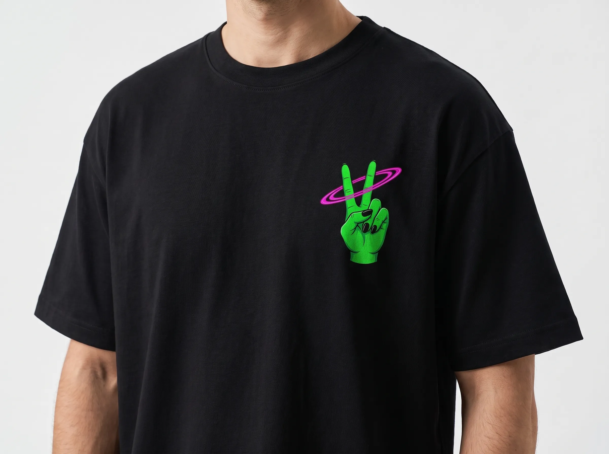

# KOSMO ROLL

> **Streetwear para quem não nasceu para seguir a mesma rota.**

A **Kosmo Roll** é uma marca independente de streetwear que transforma referências visuais, cultura urbana e identidade em peças para quem quer vestir a própria presença.

Este repositório contém o site oficial da marca: um e-commerce moderno, responsivo e construído para evoluir junto com a experiência da Kosmo Roll.

**Instagram:** [@kosmoroll.co](https://www.instagram.com/kosmoroll.co/)

---

## ✦ O projeto

O Kosmo Roll Store reúne catálogo, edições limitadas, descoberta de produtos, carrinho e checkout em uma experiência visual inspirada na identidade da marca.

Entre as experiências disponíveis estão:

- 🛍️ Catálogo de produtos
- 🪐 Edições limitadas e peças numeradas
- ✨ Experiência visual com estética editorial/cósmica
- 🧭 Quiz **“Qual é sua órbita?”** para descobrir estilos e receber recomendações
- 🔎 Busca e navegação por categorias
- 🛒 Carrinho e checkout
- 👤 Área da conta
- 🎁 Vale-presente e cupons
- 📜 Certificado de autenticidade e validação
- 📱 Experiência responsiva para mobile e desktop

---

## 🖼️ Produto em destaque

<p align="center">
  
</p>

<p align="center"><strong>Alien Joia Tee</strong><br />Uma das peças que representam a identidade visual da Kosmo Roll.</p>

> As imagens utilizadas pelo site ficam no próprio catálogo do projeto e podem ser substituídas/adicionadas conforme novos drops e coleções forem lançados.

---

## 🧩 Stack

| Tecnologia | Uso |
| --- | --- |
| **React 19** | Interface e componentes |
| **TypeScript** | Tipagem e segurança de código |
| **Vite** | Build e desenvolvimento |
| **Tailwind CSS** | Estilização |
| **Framer Motion** | Animações e microinterações |
| **React Router** | Navegação |
| **Vitest** | Testes unitários e integração |
| **Playwright** | Testes E2E, visual e acessibilidade |
| **MSW** | Mock de APIs nos testes |

---

## 🚀 Rodando localmente

### Pré-requisitos

- Node.js 20+
- npm

### Instalação

```bash
npm install
```

### Desenvolvimento

```bash
npm run dev
```

### Build de produção

```bash
npm run build
```

### Lint

```bash
npm run lint
```

---

## 🧪 Qualidade e testes

O projeto possui uma suíte ampla de testes para validar comportamento, acessibilidade, segurança, performance e experiência do usuário.

| Comando | Objetivo |
| --- | --- |
| `npm run test` | Testes unitários, integração e resiliência |
| `npm run test:coverage` | Relatório de cobertura |
| `npm run test:a11y` | Acessibilidade automatizada |
| `npm run test:visual` | Regressão visual |
| `npm run test:perf` | Performance |
| `npm run test:stress` | Testes de estresse |
| `npm run test:security` | Segurança, XSS e sanitização |
| `npm run test:e2e` | Testes end-to-end com Playwright |
| `npm run test:exploratory` | Testes exploratórios/fuzzing |

Para detalhes sobre a estratégia de qualidade, consulte [`TESTING_GUIDE.md`](./TESTING_GUIDE.md) e [`EXPLORATORY_TESTING.md`](./EXPLORATORY_TESTING.md).

---

## 📁 Estrutura

```text
src/
├── assets/       # Recursos visuais
├── components/   # Componentes reutilizáveis
├── config/       # Configurações
├── context/      # Contextos React
├── data/         # Catálogo e dados iniciais
├── pages/        # Páginas e rotas
├── store/        # Estado e catálogo
├── tests/        # Testes automatizados
├── types/        # Tipos TypeScript
└── utils/        # Utilitários
```

---

## 🎨 Direção de produto

A interface foi pensada para que tecnologia e identidade de marca trabalhem juntas: animações têm função, o catálogo é visual e a navegação busca criar uma sensação de descoberta em vez de apenas apresentar uma lista de produtos.

O projeto também mantém o catálogo como fonte das recomendações, permitindo que novas peças entrem na experiência sem precisar duplicar dados em cada funcionalidade.

---

## 📌 Documentação relacionada

- [`IDEIAS.md`](./IDEIAS.md) — roadmap e ideias de evolução
- [`TESTING_GUIDE.md`](./TESTING_GUIDE.md) — estratégia de testes
- [`EXPLORATORY_TESTING.md`](./EXPLORATORY_TESTING.md) — testes exploratórios

---

## 📲 Kosmo Roll

**Vista o que você é. Crie sua própria órbita.**

Instagram: [@kosmoroll.co](https://www.instagram.com/kosmoroll.co/)

---

<p align="center">
  <strong>KOSMO ROLL ©</strong>
</p>
